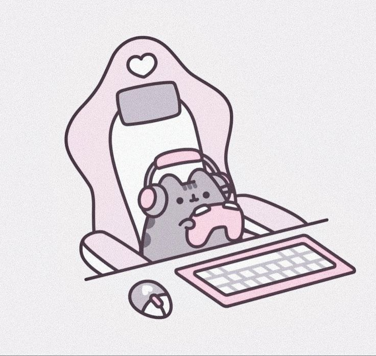

# Graphik Designer

**Leonchikova Anastasiya**  
[About me](#about-me) | [Experience](#my-wayexperience) | [Education](#education) | [Skills](#skills) | [Code Example](#code-example)

## About me

I was born and grew up in a city where there were always a lot of gray walls — maybe that’s why, since childhood, I’ve wanted to add bright colors and unusual shapes to the world around me. I remember doodling in the margins of my school notebooks, inventing fonts for my friends, and dreaming that one day my drawings would be seen by thousands of people.

Now, my life is a constant search for inspiration in the simplest things: in the morning light falling on a coffee cup, in the texture of old asphalt after the rain, in the random color combinations in store windows. I can spend a long time looking at the work of street artists or getting lost in the architectural details of buildings — for me, that's a whole universe of ideas.

When I'm not working, you'll most likely find me with a camera in my hands: I love capturing moments that have a certain mood and a sense of mystery. I also collect vinyl records — not so much for the music, but for the aesthetics of the album covers and the tactile experience. And I'm a huge foodie; for me, cooking dinner is like composing a collage of textures, tastes, and aromas.

In people, I value sincerity and the ability to be amazed. I try not to lose that childlike curiosity myself — to ask questions, try new things, make mistakes, and laugh about them. I believe that real magic happens at the intersection of different disciplines and personalities, so I’m always happy to absorb the experience of others and share my own.

I dream that my work will not only be pleasing to the eye but will also become part of someone’s story, bring a smile to their face, or inspire them to take action. If our values resonate, I’d be happy to meet you and collaborate on projects!
